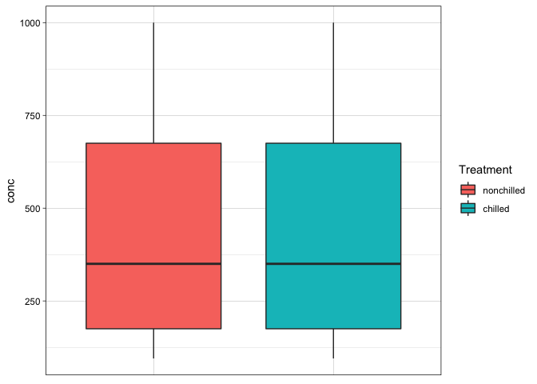
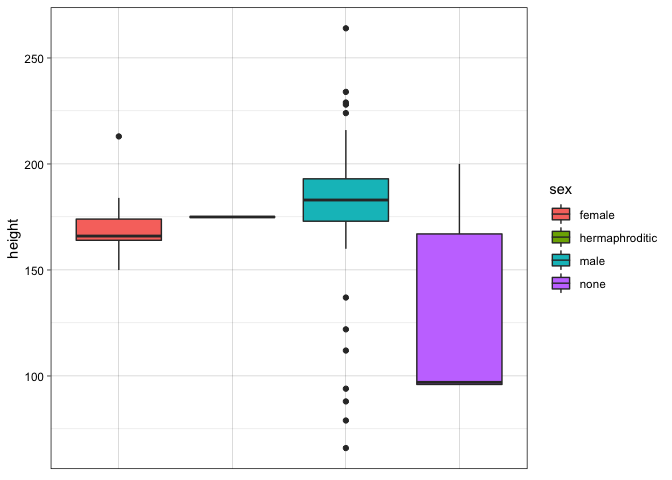
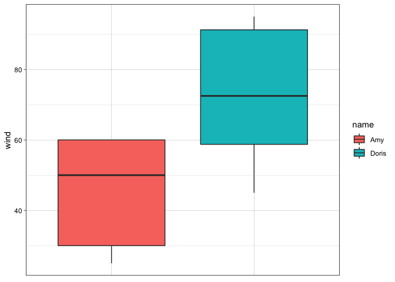

# Boxplot

The Boxplot package has been designed to allow users to create
aestheticly pleasing and clean-looking boxplots. This package has
specifically been designed for plotting numerical data across a variety
of different categories. This package contains 1 function, the
boxplot_numeric_category function, which plots a numeric variable across
the categories of a categorical variable. This function also cleans the
dataset before creating the boxplot by removing any NA values from the
dataset. This function works for a variety of different datasets, as can
be seen in the examples section of the documentation for the
boxplot_numeric_category function, and in the examples section below.

## Installation

You can install the development version of Boxplot from
[GitHub](https://github.com/) with:

    # install.packages("devtools")
    devtools::install_github("juliafast/Boxplot")

## Examples

*For the below examples, I will be using some of the datasets contained
in the r `datasets` and `dplyr` packages. I will also use piping, which
requires the `magrittr` package. These packages will have been installed
as part of downloading the Boxplot package*

``` r
#load the Boxplot, datasets, dplyr, and magrittr packages
library(Boxplot)
library(datasets)
library(magrittr)
library(dplyr)
#> 
#> Attaching package: 'dplyr'
#> The following objects are masked from 'package:stats':
#> 
#>     filter, lag
#> The following objects are masked from 'package:base':
#> 
#>     intersect, setdiff, setequal, union
```

Below is a basic example which shows you how to use the
boxplor_numeric_category function.

The boxplot_numeric_category function in the `Boxplot` package can be
used to create a boxplot from data contained in the “CO2” dataframe from
the r `datasets` package that shows the distribution of CO2
concentration of grass plants in each of two treatment types (chilled or
nonchilled):

``` r
boxplot_numeric_category(dataframe = CO2, x = Treatment, y = conc)
```



Below is a basic example which shows you how to use the
boxplor_numeric_category function while using piping to keep the code
clean:

The boxplot_numeric_category function can also be used to create a
boxplot from data contained in the “starwars” dataset from the `dplyr`
package that shows the distribution of the height of starwars characters
based on the sex of the characters:

``` r
starwars %>% boxplot_numeric_category(sex, height)
```



Below is an example which shows you how to use the
boxplot_numeric_category function in conjunction with other functions,
in this case the **filter** function from the `dplyr` package.

The boxplot_numeric_category function can also be used to create a
boxplot from data contained in the “storms” dataset from the `dplyr`
package that shows the distribution of the wind speeds observed for each
of the storms Caroline and Doris:

``` r
boxplot_numeric_category((storms %>% filter(name == c("Amy", "Doris"))), name, wind)
```



Below is an example which shows you how not to use the
boxplot_numeric_category function.

Below is a line of code that shows a use of the boxplot_numeric_category
function that will return an error message. This function requires a
categorical input for the “x” argument and a numeric input for the “y”
argument.

Using the “starwars” dataset from the dplyr package, we will attempt to
use the boxplot_numeric_category function to create a boxplot that shows
the distribution of the name of starwars characters based on the sex of
the characters. Because the y input below, name, is not a numeric input,
an error message will appear:

``` r
boxplot_numeric_category(starwars, sex, name)
#> Error in boxplot_numeric_category(starwars, sex, name): You have entered a non-numeric, non-integer, or non-double input. Please enter a variable of a numeric, integer, or double class for the y input. Class type of the variable you entered is: character
```
